annotation-efficient, less-anotation data

> “Small Data Challenges in Big Data Era: A Survey of Recent Progress on Unsupervised and Semi-Supervised Methods"

## TO DO

- 1 Learning From less-annotation data
  - Semi-supervised learning
  - Self-supervised learning
  - Few-shot learning
  - Meta-learning
  - Domain Adaptation
  - Domain Generalization
  - GAN-assisted
- 2 Few shot segmentation

## 1 Learning From less-annotation data

### 1.1 Semi-supervised learning

> 少量有带标签的样本和大量无标签的样本, 并且unlabeled data的数量要远大于labeled data

- 三个基本假设

  - 从本质上说，这三类假设是一致的,只是相互关注的重点不同。其中Manifold Assumption更具有普遍性。
  - **Smoothness Assumption**
    - 位于稠密数据区域的两个距离很近的样例的类标签相似，也就是说，当两个样例被稠密数据区域中的边连接时，它们在很大的概率下有相同的类标签；相反地，当两个样例被稀疏数据区域分开时，它们的类标签趋于不同。
    - 人话：如果两个样本 x1，x2 相似，那么它们的相应输出 y1，y2 也应如此。i.e., 如果两个输入是同一类，同一簇，那么它们相应的输出需要相近，反之亦成立。
  - **Cluster Assumption**
    - 当两个样例位于同一聚类簇时，它们在很大的概率下有相同的类标签。这个假设的等价定义为低密度分离假设(Low Sensity Separation Assumption)，即分类决策边界应该穿过稀疏数据区域，而避免将稠密数据区域的样例分到决策边界两侧。
    - 聚类假设是指样本数据间的距离相互比较近时，则他们拥有相同的类别。根据该假设，分类边界就必须尽可能地通过数据较为稀疏的地方，以能够避免把密集的样本数据点分到分类边界的两侧。在这一假设的前提下，学习算法就可以利用大量未标记的样本数据来分析样本空间中样本数据分布情况，从而指导学习算法对分类边界进行调整，使其尽量通过样本数据布局比较稀疏的区域。例如，Joachims提出的转导支持向量机算法，在训练过程中，算法不断修改分类超平面并交换超平面两侧某些未标记的样本数据的标记，使得分类边界在所有训练数据上最大化间隔，从而能够获得一个通过数据相对稀疏的区域，又尽可能正确划分所有有标记的样本数据的分类超平面。
    - Short: 假设输入数据点形成簇，每个簇对应于一个输出类，那么如果点在同一个簇中，则它们可以认为属于同一类。聚类假设也可以被视为低密度分离假设，即：给定的决策边界位于低密度地区。两个假设之间的关系很容易看出。一个高密度区域，可能会将一个簇分为两个不同的类别，从而产生属于同一聚类的不同类，这违反了聚类假设。在这种情况下，我们可以限制我们的模型在一些小扰动的未标记数据上具有一致的预测，以将其判定边界推到低密度区域。
  - **Manifold Assumption**
    - （a）输入空间由多个低维流形组成，所有数据点均位于其上；（b）位于同一流形上的数据点具有相同标签。

- 纯工程角度: 使用无标签的数据学习来指导有监督，e.g. 用在初始化

  - 对于神经网络来说，一个好的初始化可以使得结果更稳定，迭代次数更少。
    - 无监督预训练：一是用所有数据逐层重构预训练，对网络的每一层，都做重构自编码，得到参数后用有标签数据微调；
    - 伪有监督预训练：二是用所有数据训练重构自编码网络，然后把自编码网络的参数，作为初始参数，用有标签数据微调。

- 第一类方法 --- 代理/伪标签  (Proxy/ pseudo-label)

  - > 找某种方法给unlabel data 打上信息

  - 代理标签方法是使用预测模型或它的某些变体生成一些代理标签，这些代理标签和有标记的数据混合一起，提供一些额外的训练信息，即使生成标签通常包含嘈杂，不能反映实际情况。这类方法主要可分为分为两类：self-training（模型本身生成代理标签）和 multi-view learning（代理标签是由根据不同数据视图训练的模型生成的）。

  - Label Propagation Algorithm, 标签传播

    - 基于图的半监督算法，通过构造图结构（数据点为顶点，点之间的相似性为边）来寻找训练数据中有标签数据和无标签数据的关系.

  - Self-training -- 伪标签

    - 在一批有标签和没有标签的图像上同时训练一个模型。在使用交叉熵损失的情况下，以普通的监督的方式对有标签图像进行训练。利用同一模型对一批没有标签的图像进行预测，并使用置信度最大的类作为伪标签。然后，通过比较模型预测和伪标签对没有标签的图像计算交叉熵损失。

    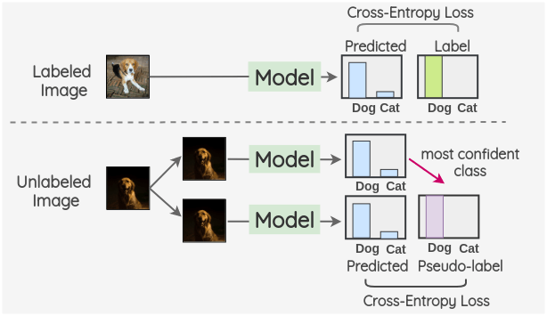

  - Self-training -- 知识蒸馏 (Noisy Student)

    - 训练两种不同的模型，即“Teacher”和“Student”。Teacher 模型首先对有标签的图像进行训练，然后对没有标签的图像进行伪标签推断。这些伪标签可以是软标签，也可以通过置信度最大的类别转换为硬标签。然后，将有标签和没有标签的图像组合在一起，并根据这些组合的数据训练一个 Student 模型。使用 RandAugment 进行图像增强作为输入噪声的一种形式。此外，模型噪声，如 Dropout 和随机深度也用到了 Student 模型结构中。之后，一旦学生模型被训练好了，它就变成了新的老师，这个过程被重复三次。

      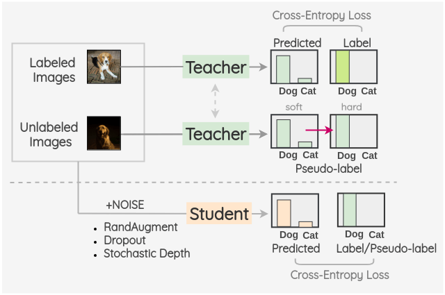

  - Multi-view training - Co-training

    - > 同时训练两个模型，一个模型给另一个模型提供置信度高的数据(打标签之后)提供给另一个模型。

    - Multi-view training 利用了在实际应用中非常普遍的多视图数据。多视图数据可以通过不同的测量方法（例如颜色信息和纹理）收集不同的视图图片信息，或通过创建原始数据的有限视图来实现。在这种情况下，MVL 的目标是学习独特的预测函数 fθi 为数据点 x 的给定视图 vi(x) 建模，并共同优化所有用于提高泛化性能的功能。理想情况下，可能的观点相互补充以便所生产的模型可以相互协作以提高彼此的性能。

    - m1 和 m2 两个模型，它们分别在不同的数据集上训练。每轮迭代中，如果两个模型里的一个模型，比如模型 m1 认为自己对样本 x 的分类是可信的，置信度高，分类概率大于阈值 τ ，那 m1 会为它生成伪标签，然后把它放入 m2 的训练集。简而言之，一个模型会为另一个模型的输入提供标签。

  - Multi-view training - Tri-Training

    - Bagging: 对有标记示例集进行可重复取样（bootstrap sampling）以获得三个有标记训练集，然后从每个训练集产生一个分类器。
    - 在协同训练过程中，各分类器所获得的新标记示例都由其余两个分类器协作提供，具体来说，**如果两个分类器对同一个未标记示例的预测相同，则该示例就被认为具有较高的标记置信度，并在标记后被加入第三个分类器的有标记训练集。**

- 第二类方法 --- 一致性正则化 (Consistency Regularization)

  - > 给未标记的图像添加了噪声之后，对他们的模型预测也应该保持不变。我们可以使用输入噪声，如图像增强和高斯噪声。噪声也可以通过使用 Dropout 引入到结构中。
    >
    > **核心: 不同方法就是对图像做不同的数据增强。但是对不同图像需要找到一种更适合的数据增强，因为数据增强不应该是一成不变的，而是如 UDA 所述不同的任务其数据扩增应该要不一样。**

  - 利用未标记的数据来强化训练模型，使其符合聚类假设，即学习的决策边界必须位于低密度区域。这些方法基于一个简单的概念，即如果对一个未标记的数据应用实际的扰动，则预测不应发生显著变化，因为在聚类假设下，具有不同标签的数据点在低密度区域分离。 具体来说，给定一个未标记的数据点 ![[公式]](https://www.zhihu.com/equation?tex=x%E2%88%88D_u) 及其扰动的形式 ![[公式]](https://www.zhihu.com/equation?tex=%5Chat+x)，**目标是最小化两个输出之间的距离**， 常用的距离测量通常是均方误差（MSE），Kullback-Leiber散度（KL）和Jensen-Shannon散度（JS）。 核心思想就是**最小化未标记数据与其扰动输出两者之间的距离**，但不同方法you不同的计算形式。

  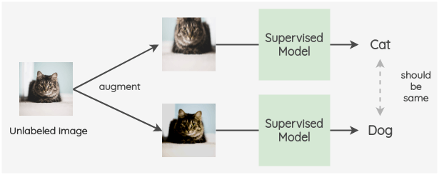

  - PI-Model
    - 关键思想是为标记数据和未标记数据创建两个随机的图像增强。然后，使用带有 dropout 的模型对两幅图像的标签进行预测。这两个预测的平方差被用作一致性损失。对于标记了的图像，我们也同时计算交叉熵损失。总损失是这两个损失项的加权和。权重 w(t)用于决定一致性损失在总损失中所占的比重。
    - 由于正则化技术（例如 data augment 和 dropout）通常不会改变模型输出的概率分布，Pi-Model 正是利用神经网络中这种预测函数的特性，对于任何给定的输入 x，使用不同的正则化然后预测两次，而目标是减小两次预测之间的距离，**提升模型在不同扰动下的一致性**，Pi-Model 使用 MSE 做为两个概率分布之间的损失函数。
    - 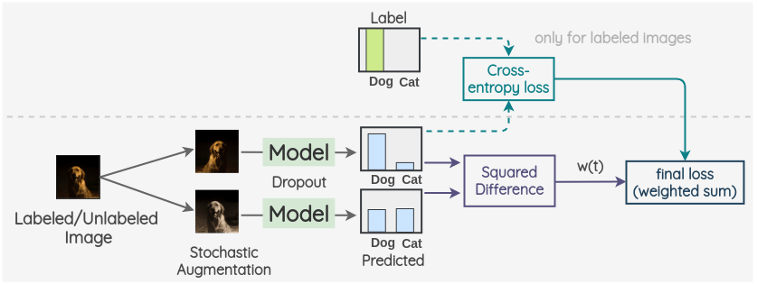
  - Temporal Ensembling
    - 在 Pi-Model 的基础上进一步提出了**Temporal Ensembling**，其整体框架与 Pi-model 类似，在获取无标签数据的处理上采用了相同的思想，唯一的不同是： **在目标函数的无监督一项中， Pi-Model 是两次前向计算结果的均方差，而在temporal ensembling 模型中，使用时序组合模型，采用的是当前模型预测结果与历史预测结果的平均值做均方差计算。有效地保留历史了信息，消除了扰动并稳定了当前值。**
    - 与Pi-model同作者，通过利用预测的指数移动平均(EMA)来修正模型。相对于 Pi-Model，它 有两方面的好处：
      - 用空间来换取时间，总的前向推理次数减少了一半，因而减少了训练时间；
      - 通过历史预测做平均，有利于平滑单次预测中的噪声。
    - 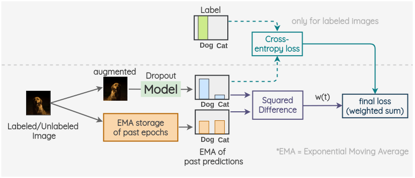
  - Mean teachers
    - Mean Teachers 则是 Temporal Ensembling 的改进版，Temporal Ensembling 对模型的预测值进行 EMA（exponential moving averag），而**Mean Teachers 采用了对 studenet 模型权重进行 EMA**
    - 关键思想是有两种模型，“Student”和“Teacher”。Student 模型是有 dropout 的常规模型。教师模型与学生模型具有相同的结构，但其权重是使用学生模型权重的指数移动平均值来设置的。对于已标记或未标记的图像，我们创建图像的两个随机增强的版本。然后，利用学生模型预测第一张图像的标签分布。利用教师模型对第二幅增强图像的标签分布进行预测。这两个预测的平方差被用作一致性损失。对于标记了的图像，我们也计算交叉熵损失。最终损失是这两个损失项的加权和。
    - 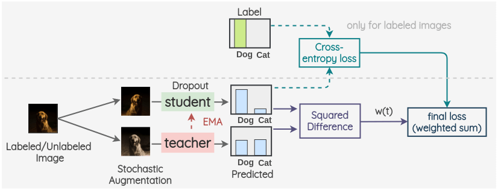
  - Virtual Adversarial Training
    - 利用对抗性攻击的概念进行一致性正则化。关键的想法是生成一个图像的对抗性变换，着将改变模型的预测。为此，首先，拍摄一幅图像并创建它的对抗变体，使原始图像和对抗图像的模型输出之间的 KL 散度最大化。
    - 将带标签/不带标签的图像作为第一个观测，并将在前面步骤中生成的与之对抗的样本作为第二个观测。然后，用同一模型对两幅图像的标签分布进行预测。这两个预测的 KL 散度被用作一致性损失。对于标记了的图像，我们也计算交叉熵损失。最终损失是这两个损失项的加权和。采用加权偏置模型来确定一致性损失在整体损失中所占的比重。
    - 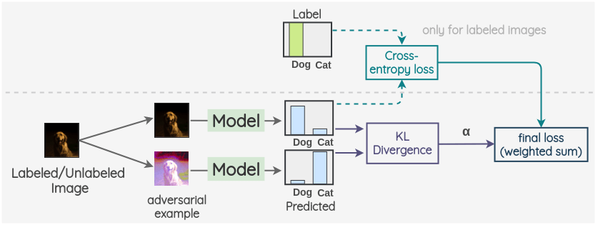
  - Unsupervised Data Augmentation
    - 之前的工作中对未标记的数据加入噪声增强的方式主要是采用简单的随机噪声，但是**这篇文章发现对输入 x 增加的噪声 α 对模型的性能提升有着重要的影响**，因此 UDA 提出对未标记的数据采取更多样化更真实的数据增强方式，并且对未标记的数据上优化相同的平滑度或一致性增强目标。它使用自动增强创建一个增强版本的无标签图像，然后用同一模型对两幅图像的标签进行预测。这两个预测的 KL 散度被用作一致性损失。对于有标记的图像，我们只计算交叉熵损失，不计算一致性损失。最终的损失是这两个损失项的加权和。
    - **UDA 证明了针对性的数据增强效果明显优于无针对性的数据增强**，这一点和监督学习的 AutoAugment、RandAugment 的结论是一致的。
    - 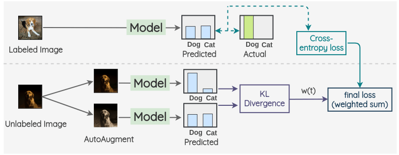
    - 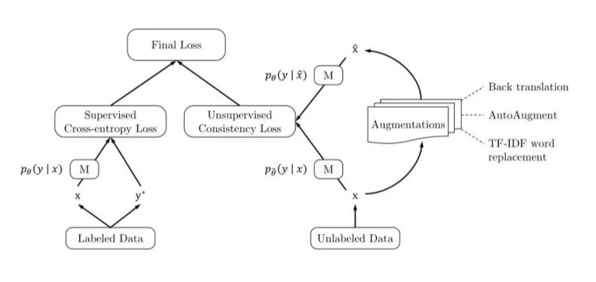

- 第三类方法 --- 混合方法 (Holistic Methods)

  - > 在一个框架中融合多个当前的 SSL 的方法，以期获得更好的性能。

  - MixMatch

    - 对于给定一批有标签的 X 和同样大小未标签的 U，先生成一批经过处理的增强标签数据 X' 和一批伪标签的 U'，然后分别计算带标签数据和未标签数据的损失项。具体步骤：1) 对于标记了的图像，我们创建一个增强图像。对于未标记的图像，我们创建 K 个增强图像，并对所有的 K 个图像进行模型预测。然后，对预测进行平均以及温度缩放得到最终的伪标签。这个伪标签将用于所有 k 个增强。2) 将增强的标记了的图像和未标记图像进行合并，并对整组图像进行打乱。然后取该组的前 N 幅图像为 W~L~，其余 M 幅图像为 W~U~ 3) 在增强了的有标签的 batch 和 W~L~之间进行 Mixup。同样，对 M 个增强过的未标记组和 W~U~中的图像和进行 mixup。因此，至此得到了最终的有标签组和无标签组 4) 对于有标签的组，我们使用 ground truth 混合标签进行模型预测并计算交叉熵损失。同样，对于没有标签的组，我们计算模型预测和计算混合伪标签的均方误差(MSE)损失。对这两项取加权和，用 λ 加权 MSE 损失

      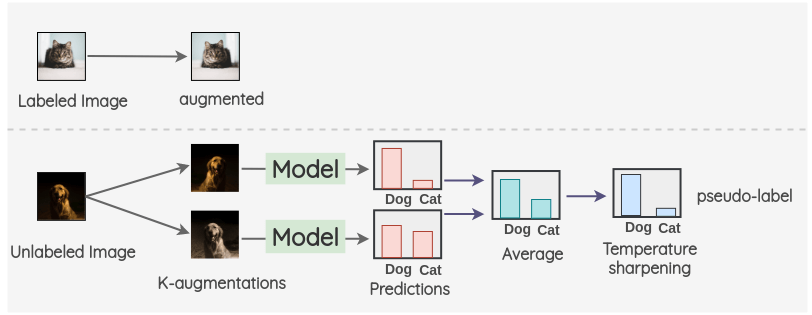
      
      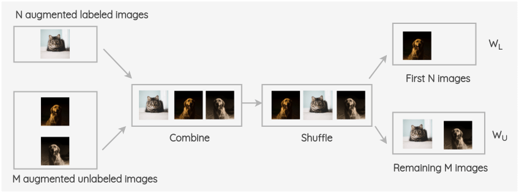
      
      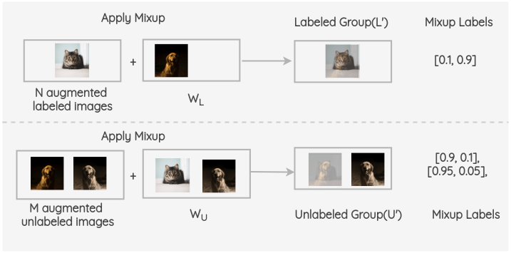
      
      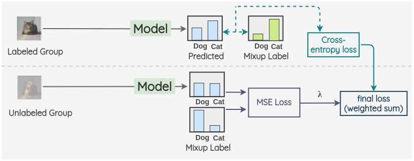
    
  - FixMatch

    - 相比Mixmatch，结合了伪标签和一致性正则化，极大地简化了整个方法。并且，FixMatch使用 Wide-Resnet 变体作为基础体系结构，记为 **Wide-Resnet-28-2**，其深度为 28，扩展因子为 2。因此，此模型的宽度是 ResNet 的两倍。
    - 过程: 在有标签图像上使用交叉熵损失训练一个监督模型。对于每一幅未标记的图像，分别采用**弱增强和强增强**方法得到两幅图像。弱增强的图像被传递给我们的模型，我们得到预测。把置信度最大的类的概率与阈值进行比较。如果它高于阈值，那么我们将这个类作为标签，即伪标签。然后，将强增强后的图像通过模型进行分类预测。该预测方法与基于交叉熵损失的伪标签的方法进行了比较。把两种损失合并来优化模型。
    - 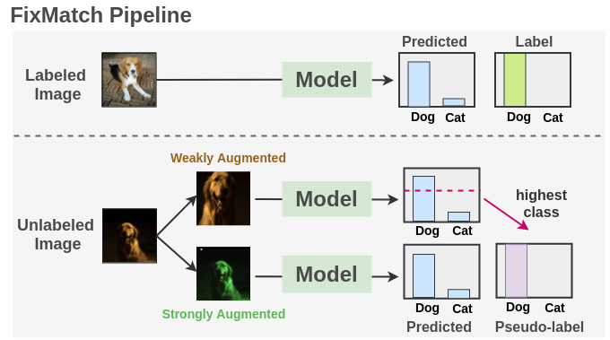

  - 各种方法总结

    - 当标注的数据较少时模型训练容易过拟合，
      - **一致性正则化方法**通过鼓励无标签数据扰动前后的预测相同使学习的决策边界位于低密度区域
        - 强制数据点的实际扰动不应显著改变预测器的输出。模型应该为输入及其实际扰动变量给出一致的输出。人类对于小的干扰是相当鲁棒的。例如，给图像添加小的噪声(e.g.改变一些像素值)对我们来说是察觉不到的。机器学习模型也应该对这种扰动具有鲁棒性。通常通过最小化对原始输入的预测与对该输入的扰动版本的预测之间的差异来实现
      - **代理标签法**通过对未标记数据制作伪标签然后加入训练，以得到更好的决策边界，
        - 一个模型一开始在有标记的数据集上进行训练，然后用来对没有标记的数据进行预测。它从未标记的数据集中选择那些具有高置信度(高于预定义的阈值)的样本，并将其预测视为伪标签。然后将这个伪标签数据集添加到标记数据集，然后在扩展的标记数据集上再次训练模型。这些步骤可以执行多次
      - **混合方法** 融合前两点, 性能更好。

    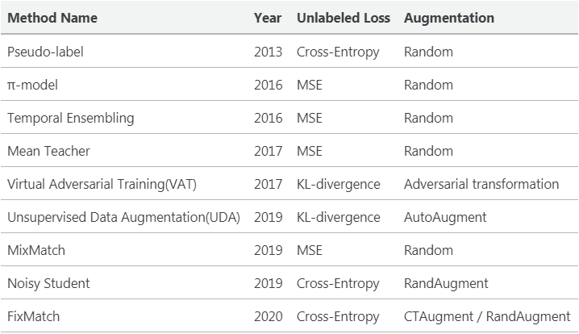

